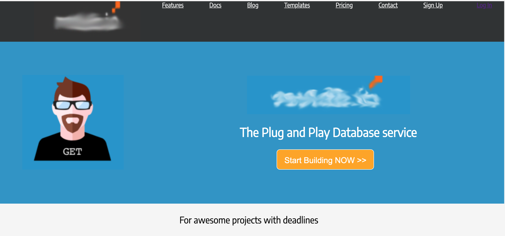

# HTML/CSS Exerice - Turlututu Homepage Rebuild

This exercice was made by [**Bérengère Carpentier**](https://github.com/carpentierberengere/ "GitHub Profile")

Finished on the **29th** of Octobre.

## What was asked ? 

We were asked to remake a homepage from scratch.

## What did we do ?

We were given a picture of [**Turlututu's homepage**](https://raw.githubusercontent.com/becodeorg/bxl-hopper-1-25/master/The%20Field/3.HTML%2BCSS/0.progressive_enhancement/turlututu.png?token=ARM2IOIM6WW3EWLL4CO4S6C7UPJP4), and using what we had learned and discovered while doing the [Chinese Farmer exercice](https://github.com/carpentierberengere/progressive-enhancement), we remade the webpage using screenshots of the images or pictures that were similar to the original ones. 
We also rebuild the HTML squeletton and the CSS stylesheet to match the original webpage.

## What did we learn ?

We learned to visualize and recreate a webpage, as well as some more css techniques. 

## What did we use ?

* HTML5
* CSS3
* This [Image](https://raw.githubusercontent.com/becodeorg/bxl-hopper-1-25/master/The%20Field/3.HTML%2BCSS/0.progressive_enhancement/turlututu.png?token=ARM2IOIM6WW3EWLL4CO4S6C7UPJP4)

## Preview of my work

